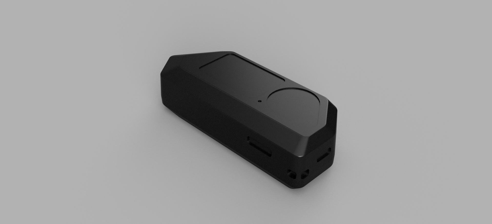

# Flipper bounding box

This folder contains flipper's bounding box - basically main features, if you remove all the fillets/holes for usb, SD card, etc. All the measurements were taken from the official model/official blueprints. This can be used for modeling cases/making modules acound flipper.

The fist model - flipper bounding box - is useful for moding cases around of. The second model is a rough approximation with simplified geometry - useful for modeling 