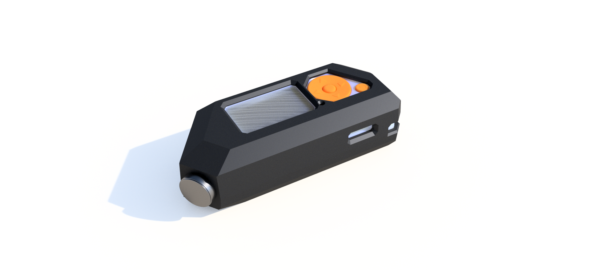

# Hard edgy case

The title says it all, it's an edgy case intended to be made from hard plastic. It consists of two halves joined with 3 14 or 16x2.5 mm screws with 3 corresponding 2.5mm nuts. Flipper sits in between preferably separated from the case with some soft material to cusion it in case of a fall.

One of the main features of this case is a normal integrated ibutton contact, make from a dmelled out key, which replaces flipper's not horrible, but not great design. For it to work, you have to do some wiring: glue small metal plates beneath flipper's contacts and connect them to the new one.

This model was **not** tested as I don't have my flipper yet, some anyone, feel free to tweek parameters for it to fit your device - I apologize in advanse for the non-trivial fusion model structure.

## Important

Version 2 added with several improvements on the overall design - added space for pcb modules to fit in the case (version 1 did not have enough space), the halves division is changed to wrap around a device with an already connected module, both GPIO and the opposite site are made flat for future work (maybe rails for  snap-fit printable modules?)